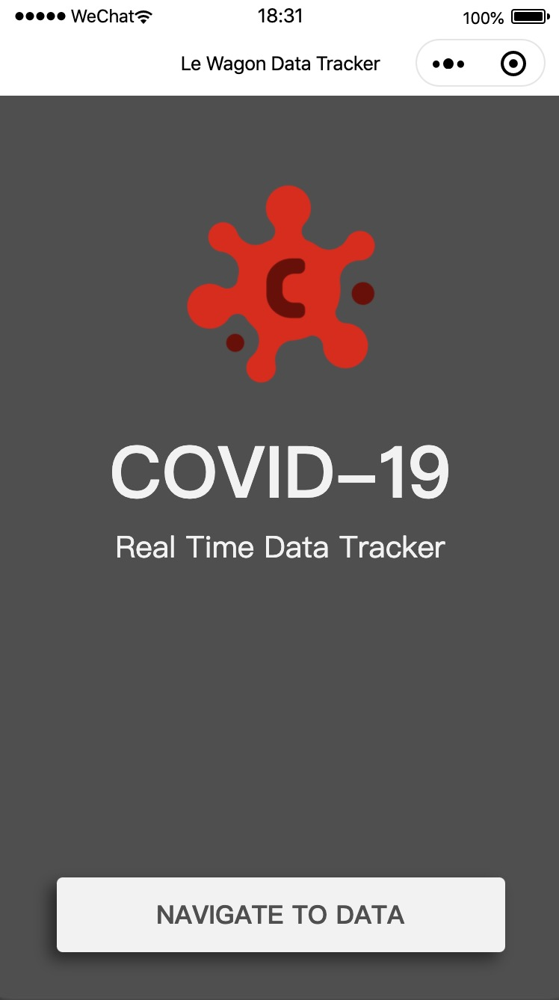
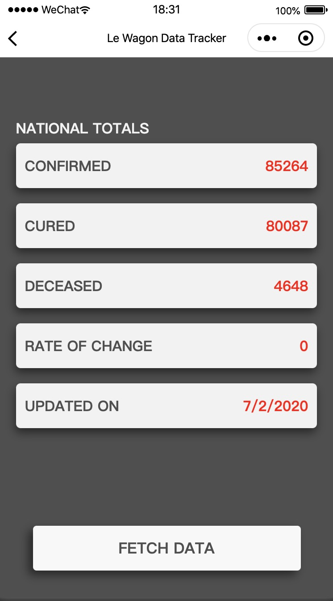

# LeWagon_COVID-19_Tracker_WeChatMP
[Le Wagon COVID-19 Data Tracker WeChat Mini-Program Tutorial](https://www.notion.so/lewagon/Le-Wagon-Build-a-Real-Time-Data-Tracker-in-WeChat-1498c5548da04d96bcb8ccad090d6765)

 

## Installation

1. Clone repository
2. Download and install the Integrated Development Environment (IDE) for WeChat: [Select "Stable build" and choose Windows 64 or Mac](https://developers.weixin.qq.com/miniprogram/dev/devtools/download.html). If you are using Linux, [check this open source hack](https://github.com/cytle/wechat_web_devtools).
3. Open WeChat's IDE to load project
    - Turn off any VPN. On the home screen, scan the QR code with your personal WeChat. You should read "Scan succesfully". On your mobile, authorize the login. 
5. Choose **"Mini Program"** from the left menu
6. Choose **"Import Project"**  from the top tab bar
7. In the "**Directory**" input, choose the folder holding this repository
8. In the "**AppID**" input, if nothing appears, choose "Test Account"
9. Press the green "**Import**" button on the bottom right
